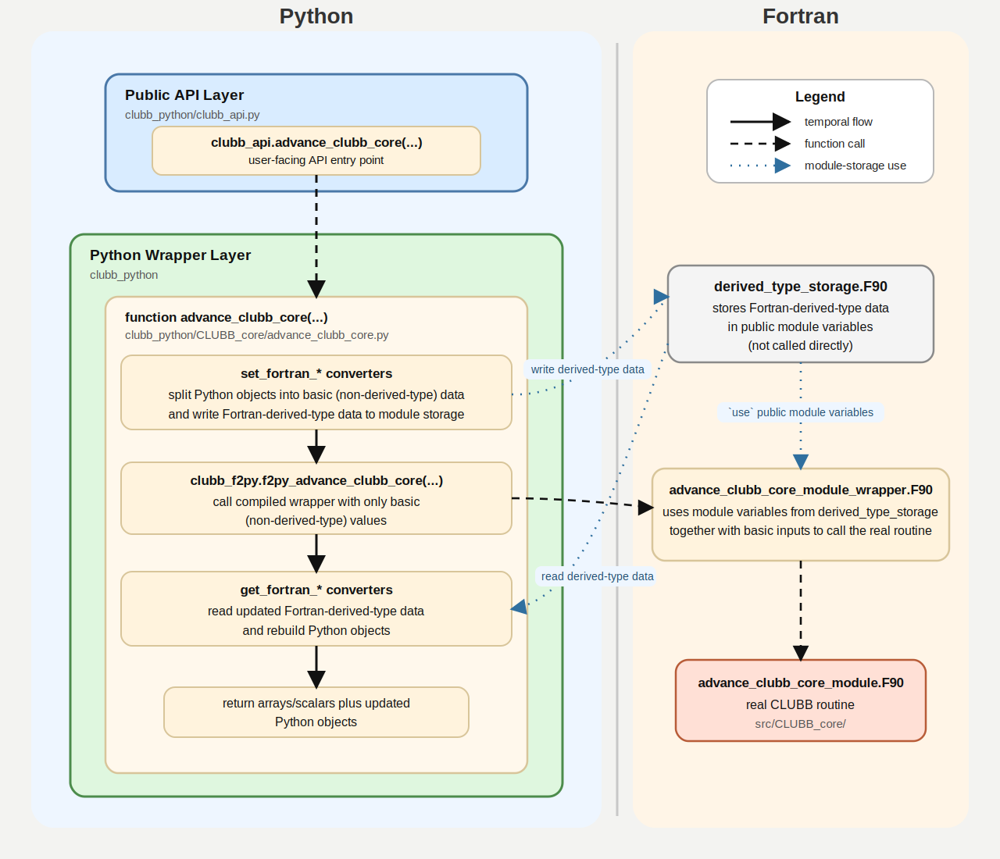

# CLUBB Python API

This directory contains the Python API for calling Fortran-compiled CLUBB routines from Python.

The main import is:

```python
from clubb_python import clubb_api
```

This is the routine-level interface to CLUBB. It is not the SCM driver. The
driver lives separately under [clubb_python_driver/](../clubb_python_driver/).

The API is meant to expose the public cross-module routine surface in
[src/CLUBB_core/](../src/CLUBB_core/) so that
Python code can call into CLUBB one routine at a time.

`clubb_python_api/` is the layer that lets Python code call CLUBB routines in a
way that still looks like CLUBB.

The main pieces are:

- the public entrypoint is [clubb_python/clubb_api.py](./clubb_python/clubb_api.py#L1)
- most wrapped routines live in [clubb_python/CLUBB_core/](./clubb_python/CLUBB_core/)
- Python versions of Fortran-derived-types such as `Grid`, `ErrInfo`, and
  `pdf_parameter` live in [clubb_python/derived_types/](./clubb_python/derived_types/)

The main challenge in this API is not ordinary numeric arrays. It is
Fortran-derived-types. Arrays and scalars are straightforward to pass in and out.
Fortran-derived-types are not. A large part of the wrapper logic exists to make
those types behave naturally from Python.

## Getting Started

Build the Python API from the repo root:

```bash
./compile.py [-debug] -python
```

Make `clubb_python_api/` importable:

```bash
export PYTHONPATH="/path/to/clubb/clubb_python_api:${PYTHONPATH}"
```

Then import the API:

```python
from clubb_python import clubb_api
```

Or, in a separate Python project:

```python
import sys
sys.path.insert(0, "/path/to/clubb/clubb_python_api")

from clubb_python import clubb_api
```

### Example

The example below is schematic rather than fully runnable. Its purpose is to
show the structure of a typical API call:

- normal numeric arrays and scalars are passed in directly
- Python-object mirrors of Fortran-derived-types are created, passed in, and
  then returned in refreshed form when the underlying Fortran routine updates
  them

```python
import numpy as np

from clubb_python import clubb_api

# Normal numeric arrays and scalars.
rtm = np.asarray(...)
thlm = np.asarray(...)
wpthlp_sfc = np.asarray(...)
# ... additional forcing, prognostic, and tendency arrays ...

# Python-object mirrors of Fortran-derived-types.
err_info = clubb_api.init_err_info(ngrdcol)
gr, err_info = clubb_api.setup_grid(..., err_info=err_info)

pdf_params = clubb_api.init_pdf_params(nzt, ngrdcol)
pdf_params_zm = clubb_api.init_pdf_params_zm(nzm, ngrdcol)

(
    # outputs numeric arrays and python-objects with updated data from
    # Fortran-derived-types
    rtm,
    ...,
    pdf_params,
    pdf_params_zm,
    err_info,
    ...,
) = clubb_api.advance_clubb_core(
    # normal numeric arrays and scalars
    rtm=rtm,
    thlm=thlm,
    wpthlp_sfc=wpthlp_sfc,
    ...,
    # Python-object mirrors of Fortran-derived-types
    gr=gr,
    pdf_params=pdf_params,
    pdf_params_zm=pdf_params_zm,
    err_info=err_info,
)
```

For a functioning end-to-end usage example, see
[clubb_python_driver/](../clubb_python_driver/). It shows how the API is used
in practice, but it currently exercises only a limited portion of the full API
surface.

For broader and more comprehensive examples, see the API tests under
[tests/](./tests/). Those tests cover much more of the wrapper surface and
return behavior, but they are written to isolate individual routines and
for testing rather than to set up a physically realistic CLUBB run.

## Code Layout

```text
clubb_python_api/
├── clubb_python/
│   ├── clubb_api.py
│   ├── CLUBB_core/
│   └── derived_types/
├── f2py_fortran_wrappers/
├── tests/
├── clubb_f2py.pyf
└── run_pytests.sh
```

Key pieces:

- [clubb_python/clubb_api.py](./clubb_python/clubb_api.py#L1): top-level public API surface
- [clubb_python/CLUBB_core/](./clubb_python/CLUBB_core/): Python functions that handle the object-type conversions and fortran wrapper call
- [clubb_python/derived_types/](./clubb_python/derived_types/): Python-object versions of Fortran-derived-types, plus conversion helpers
- [f2py_fortran_wrappers/](./f2py_fortran_wrappers/): Fortran wrappers plus the module that stores shared Fortran-derived-type data in public module variables
- [clubb_f2py.pyf](./clubb_f2py.pyf#L1): the interface-definition file that tells F2PY which wrapper
  routines to expose to Python and how their Python-visible signatures should
  look

The real CLUBB Fortran source remains under [src/CLUBB_core/](../src/CLUBB_core/).

## How API Calls Work

The inner workings are easiest to understand if you separate the system into
four layers:

1. user code calls `clubb_api`
2. a Python wrapper in [clubb_python/CLUBB_core/](./clubb_python/CLUBB_core/)
   prepares arguments
3. a Fortran wrapper in [f2py_fortran_wrappers/](./f2py_fortran_wrappers/)
   bridges into the real CLUBB routine
4. the real routine in [src/CLUBB_core/](../src/CLUBB_core/) runs

The flow below uses `advance_clubb_core` as the concrete example:



### The Important Part: Fortran-Derived-Types

Most of the complexity in this API comes from Fortran-derived-types.

Neither Python objects nor Fortran-derived-types can cross the Python/Fortran
boundary directly in the form this API needs. Only basic
non-derived-type values such as arrays, scalars, and logicals can move through
that boundary cleanly. Because of that, the wrapper layer converts Python
objects into basic values, rebuilds the corresponding Fortran-derived-types in
Fortran module storage, calls the real CLUBB routine, and then converts the
updated Fortran-derived-type data back into Python objects on return.

The main Fortran-derived-types carried through this bridge are:

- `grid`
- `sclr_idx_type`
- `clubb_config_flags_type`
- `nu_vertical_res_dep`
- `pdf_parameter`
- `implicit_coefs_terms`
- `err_info_type`
- `stats_type`

These types are stored in the Fortran storage module
[derived_type_storage.F90](./f2py_fortran_wrappers/derived_type_storage.F90#L1). The
`pdf_parameter` type appears there in both `stored_pdf_params` and
`stored_pdf_params_zm` forms because the API needs both `zt`- and `zm`-based
parameter data.

These values do not move through the Python/Fortran boundary as simply as arrays
and scalars. For that reason, the API uses a module-storage pattern:

1. a Python-object such as `Grid` is created or passed in
2. the Python wrapper calls individualized converters that split the
   Python-object into basic (non-derived-type) values and write those values
   into [derived_type_storage.F90](./f2py_fortran_wrappers/derived_type_storage.F90#L1),
   where they are recombined into Fortran-derived-types stored in public module
   variables
3. the Fortran wrapper uses those stored module variables and passes them into
   the real CLUBB routine
4. if the real routine modifies that Fortran-derived-type, the Python wrapper
   does a reverse conversion to take the updated Fortran-derived-type data from
   module storage and convert it back into a Python-object mirror of that type
   to return

That derived-type storage lives in
[derived_type_storage.F90](./f2py_fortran_wrappers/derived_type_storage.F90#L1).
It is not called directly. Its job is to hold the current Fortran-derived-type
data in public module variables for wrappers that `use` the module.

## How F2PY Is Used

This repo uses [NumPy F2PY](https://numpy.org/doc/stable/f2py/) as the step that
turns the Fortran wrapper layer into something importable from Python.

API users do not call the F2PY-generated extension module directly.
Instead, user code calls [clubb_python/clubb_api.py](./clubb_python/clubb_api.py#L1),
which then calls the module-specific Python wrappers in
[clubb_python/CLUBB_core/](./clubb_python/CLUBB_core/). Those Python wrappers
handle Python-object conversion, hidden Fortran-derived-type storage, and
return reformatting before making the internal call into the generated `clubb_f2py`
extension.

It helps to think of the build in this order:

1. write Fortran wrapper routines in [f2py_fortran_wrappers/](./f2py_fortran_wrappers/)
2. describe the Python-visible interface to those wrappers in [clubb_f2py.pyf](./clubb_f2py.pyf#L1)
3. let F2PY generate the internal Python-callable bridge code from that interface
4. call that generated module from the Python wrapper layer in [clubb_python/](./clubb_python/)
5. expose the final user-facing API through `clubb_api`

### F2PY specific file: `clubb_f2py.pyf`?

The `.pyf` file is an interface-description file used by F2PY.

It is unusual if you have not worked with F2PY before, but its role is simple:
it tells F2PY what the Python-facing version of each wrapped Fortran routine
should look like.

That includes things like:

- which wrapper routines are exposed
- argument order
- `intent(in)`, `intent(inout)`, and `intent(out)`
- array dimensions
- which values become Python return values

So the `.pyf` file is not the real CLUBB source, and it is not the wrapper
implementation either. It is the interface contract that sits between them and
the generated Python bridge.

## Nuances

### Return behavior

The API return contract applies to both ordinary numeric data and
Fortran-derived-types:

- numeric `intent(in)` arguments are passed in and are not returned
- numeric `intent(inout)` and `intent(out)` values appear in the Python return
  tuple
- Fortran-derived-type `intent(in)` arguments are pushed into hidden Fortran
  module storage, but are not returned
- Fortran-derived-type `intent(inout)` and `intent(out)` values are returned as
  refreshed Python-objects

The final return ordering follows the underlying Fortran `intent(inout/out)`
order, after compressing out hidden module-storage-carried arguments. This is why
callers should usually consume returned Python-objects directly rather than
calling `get_fortran_*` helpers themselves.

### Zero-length logical dimensions

Some CLUBB dimensions can be logically zero, but F2PY still needs concrete array
extents. In those cases the Python wrappers pass transport arrays sized with
`max(dim, 1)` and also pass the real logical dimension separately.

### Case-sensitive argument names

F2PY preserves Fortran argument name casing. If you are unsure about exact
keyword names, check the corresponding wrapper in `clubb_python/CLUBB_core/` or
the declarations in [clubb_f2py.pyf](./clubb_f2py.pyf#L1).

### Return ordering

The `.pyf` declarations define the explicit Python-visible wrapper ordering, and
the Python wrappers may reinsert refreshed Python-objects for hidden
Fortran-derived-types so the final return shape matches the intended compressed
Fortran `intent(inout/out)` contract.

## Testing

`run_pytests.sh` is the normal way to run the API test suite from the repo root.
It does two small setup steps before calling `pytest`:

- changes into `clubb_python_api/`
- sets `PYTHONPATH` so both [clubb_python/](./clubb_python/) and the repo-root
  code are importable during the test run

After that it just runs:

```bash
python3 -m pytest tests/ "$@"
```

So the script is mainly a convenience entrypoint. It lets you run the suite from
the repo root without having to remember the working directory and import-path
setup each time.

Run the full API pytest suite from the repo root:

```bash
bash clubb_python_api/run_pytests.sh
```

You can still pass ordinary pytest flags through the script. For example:

- `bash clubb_python_api/run_pytests.sh -q` for quieter output
- `bash clubb_python_api/run_pytests.sh -v` for more verbose output

Run a single test file:

```bash
python3 -m pytest clubb_python_api/tests/test_udt_roundtrip.py -q
```

The test suite covers a few different kinds of checks:

- API-surface coverage tests that verify the Python layer exposes the intended
  CLUBB routine set
- argument and return-contract tests that check wrapper signatures, return
  ordering, and the handling of hidden Fortran-derived-type storage
- roundtrip tests for Python-object and Fortran-derived-type conversion
- initialization and setup tests for things like grid, pressure, and startup
  sequences
- call-tree tests for many individual CLUBB routines, where Python calls into
  the wrapped routine and checks the returned values or error behavior

Some tests intentionally trigger CLUBB fatal-error paths and then verify the
returned error information. Those tests use local pytest helpers so passing runs stay
quiet even when the underlying CLUBB routines emit diagnostics.
